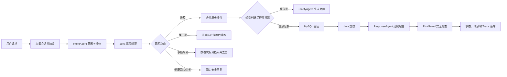

# Diet Agent 项目学习与面试指南

> 目标：不是“把代码看完”，而是达到能独立运行、解释主链路、定位问题、完成改造，并能在面试中清楚说明设计取舍的程度。

## 1. 先建立项目全景

这是一个基于 Spring Boot 3.3、Java 21、MyBatis、MySQL 8 和 AgentScope 的饮食推荐 Agent。它支持公共餐食库和个人餐食库、多轮槽位补全、换一批、多餐规划、健康风险拦截、链路追踪、人工标注与离线评估，并自带原生 HTML/CSS/JavaScript 管理页面。

项目最值得掌握的设计思想是：

> 让 LLM 处理模糊语义和自然语言，让 Java 规则掌握业务状态、数据边界、候选范围和安全底线。

不要把它理解成“给大模型套了一个接口”。一次推荐是一个可观测、可降级的业务流水线：



你最终应能用一句话概括：这是一个“规则主导编排、LLM 辅助决策、数据库约束候选、Trace 支撑评估”的有状态推荐 Agent。

## 2. 技术栈与职责

| 技术 | 在本项目中的作用 | 面试应掌握到什么程度 |
|---|---|---|
| Java 21 | record、文本块、Stream、switch 表达式等 | 能读懂模型对象与编排代码 |
| Spring Boot 3.3 | Web 接口、依赖注入、配置、异常处理 | 能说明 Controller/Service/Mapper 分层 |
| MyBatis | 会话、消息、餐食、反馈、Trace 的持久化 | 能读动态 SQL 和参数映射 |
| MySQL 8 | JSON 槽位存储与 `JSON_OVERLAPS` 召回 | 能解释查询语义、索引与性能局限 |
| AgentScope 1.0.11 | 构建 ReActAgent，接入 DashScope 模型 | 能说明 Agent 工厂、Prompt 和调用边界 |
| Qwen | 意图识别、澄清文案、推荐文案、LLM Judge | 能解释主模型/轻量模型的成本取舍 |
| 原生前端 | 聊天、餐食 CRUD、Trace 标注、评估页面 | 能从 `api.js` 对照后端 API |

## 3. 目录阅读地图

按下面顺序读，不要从第一个文件机械地读到最后一个。

```text
pom.xml                                      # 依赖和 Java 版本
src/main/resources/application.yml           # 数据库、模型、会话配置
src/main/java/com/diet/
├─ controller/                               # HTTP 入口
├─ service/orchestrator/                     # 全项目核心：状态机与路由
├─ service/intent/                           # LLM 意图识别 + Java 矫正
├─ service/slot/                             # 多轮槽位合并与槽位字典
├─ service/clarify/                          # 确定性追问规则 + LLM 文案
├─ service/meal/                             # 餐食 CRUD、召回、重排
├─ service/recommend/                        # 推荐理由和回复生成
├─ service/plan/                             # 多餐规划
├─ service/risk/                             # 健康安全规则
├─ service/session/                          # 会话状态与消息历史
├─ service/trace/                            # 全链路事件采集
├─ service/evaluation/                       # 规则评估 + LLM Judge
├─ agent/builder/                            # 各 Agent 的模型与 Prompt 装配
├─ agent/factory/                            # 会话级 Agent LRU 缓存
├─ model/、enums/                            # 数据结构与状态枚举
└─ mapper/                                   # MyBatis 接口
src/main/resources/
├─ mapper/                                   # SQL 映射
├─ diet/prompts/                             # Prompt 模板
├─ db/diet_db.sql                            # 表结构、槽位字典和样例数据
└─ static/                                   # 前端页面
```

## 4. 第一遍阅读：跑通最短主链路

### 4.1 本地环境

需要：JDK 21、Maven、MySQL 8，以及可用的 DashScope API Key。

1. 在 MySQL 中执行 `src/main/resources/db/diet_db.sql`。
2. 修改 `application.yml` 中数据库连接信息和 `agentscope.dashscope.api-key`。
3. 在包含 `pom.xml` 的目录执行：

```powershell
mvn test
mvn spring-boot:run
```

4. 浏览器访问 `http://localhost:8080/`。

当前配置把数据库密码直接写在配置文件里。学习阶段可以使用，但正式改造应改为环境变量，例如 `${DB_PASSWORD}` 和 `${DASHSCOPE_API_KEY}`，不要提交真实密钥。

如果 Maven 报本地仓库无写权限，可临时指定项目内仓库：

```powershell
mvn -Dmaven.repo.local=.m2 test
```

### 4.2 用三轮对话观察状态变化

先创建会话：

```powershell
$headers = @{ "X-User-Id" = "1" }
$session = Invoke-RestMethod -Method Post -Uri "http://localhost:8080/api/v1/diet/sessions" -Headers $headers
$session
```

第一轮只说“帮我推荐一下”，预期返回 `CLARIFY`；第二轮补“晚餐”，可能继续问目标；第三轮补“想吃清淡点”，预期进入推荐。

```powershell
$body = @{
  sessionId = $session.sessionId
  message = "帮我推荐一下"
  sourceMode = "PUBLIC"
  context = @{}
} | ConvertTo-Json

Invoke-RestMethod -Method Post `
  -Uri "http://localhost:8080/api/v1/diet/chat" `
  -Headers $headers -ContentType "application/json" -Body $body
```

每轮记录以下内容：请求、响应中的 `sessionId/traceId/responseType`、`diet_sessions` 的 `phase/slots/last_recommendations`、`diet_messages` 新增行、对应 `diet_request_trace.trace_json`。

完成标准：你能不看代码，画出三轮对话中状态如何从 `START → CLARIFY → RECOMMEND`。

## 5. 第二遍阅读：吃透一次 `/chat` 请求

主入口是 `DietChatController.dietChat`，核心是 `DietOrchestratorService`。建议给下列方法逐个打断点：

1. `dietChat`：参数校验、加载/创建会话、打开 Trace、获取会话锁。
2. `handleTurn`：记录用户消息、个人库空检查、意图识别、意图矫正、路由。
3. `handleRecommendation`：合并槽位、决定追问还是推荐。
4. `completeRecommendation`：召回、排序、生成回复、风险检查、持久化。
5. `completeAsk` / `completeTextOnly`：各分支统一收尾。

### 5.1 意图识别

实际枚举包含 6 种意图：

| 意图 | 例子 | 路由 |
|---|---|---|
| `MEAL_RECOMMENDATION` | “晚饭推荐清淡的” | 推荐主链路 |
| `CLARIFY_NEEDED` | “帮我推荐一下” | 合并槽位后判断是否追问 |
| `MEAL_ADJUST` | “换一批，清淡点” | 排除历史推荐后重跑 |
| `MEAL_PLAN` | “规划今天三餐” | 按早餐/午餐/晚餐拆分 |
| `HEALTH_RISK` | “绝食怎么瘦得快” | 固定保守回复 |
| `OTHER` | “你是谁” | 固定业务引导 |

`IntentAgentService` 会把用户原话、已知槽位、最近三条对话和数据库槽位字典交给轻量模型。模型失败或 JSON 非法时，代码会走关键词 fallback。

随后 `IntentReviseService` 再做确定性矫正：健康风险优先；没有历史推荐时不能“换一批”；多餐关键词强制规划；推荐置信度低于 0.4 时转澄清。

面试关键点：LLM 输出不是最终路由结果。它只是一个提议，业务规则拥有最后决定权。

### 5.2 槽位与多轮状态

标准槽位共 7 维：`mealTime`、`mood`、`scene`、`healthGoal`、`cuisine`、`taste`、`convenience`。

`SlotMergeService` 的规则是“本轮某一维非空则整体覆盖该维历史值，否则保留历史值”。这很简单且稳定，但无法表达“去掉辣”“清空菜系”这类否定操作。将来可以引入槽位操作类型：`SET/ADD/REMOVE/CLEAR`。

`ClarifyRuleService` 决定是否追问：

- `mealTime` 必填；
- 没有 `healthGoal` 且也没有菜系、口味、场景、便捷性强偏好时，需要补健康目标；
- Java 决定 `ASK/READY`，ClarifyAgent 只负责把问题说得自然。

这是非常好的面试案例：把“是否继续流程”做成确定性规则，把“怎么问”交给 LLM。

### 5.3 召回与排序

`MealMapper.xml` 使用 MySQL `JSON_OVERLAPS`。每个非空查询维度都必须与餐食对应维度有交集，多个维度之间是 `AND`，空维度不参与过滤，最多召回 50 条。

`MealRankService` 再计算：

```text
某维得分 = 用户在该维标签中被餐食命中的数量 / 用户该维标签总数
总分 = 7 个维度得分之和 / 7
```

随后降序取 10 条，回复 Agent 只接收 Top 3。`MEAL_ADJUST` 会在重排前过滤所有历史推荐 ID。

你需要能回答：

- 为什么先召回再排序？数据库缩小集合，Java 负责更灵活且易测试的精排。
- 为什么不会推荐数据库不存在的菜？LLM 只收到 Top 3，解析结果时又按候选 ID 白名单过滤。
- 当前公式有什么问题？空维度也进入分母，绝对分数偏低；所有维度等权；没有热度、反馈、新鲜度和多样性特征。
- 当前 SQL 有什么问题？JSON 字段的多条件查询较难利用普通索引，数据大时需要倒排标签表、搜索引擎或向量/混合检索。

### 5.4 回复、安全与降级

`RecommendResponseAgentService` 一次模型调用同时生成推荐理由和口语回复，以减少延迟与 token。模型返回后：

- 只接受 Top 3 中存在的 `mealId`；
- 缺理由时用 Java 模板补齐；
- 模型异常或 JSON 解析失败时整段使用模板回复；
- 命中减脂、低糖、控碳水、养胃等槽位时增加免责声明；
- `RiskGuardService` 最后扫描用户输入与回复，命中医疗承诺、极端节食、特殊人群等规则时，用保守文案替换整个回复。

这里形成三层防线：Prompt 约束 → 输出白名单校验 → Java 风险规则。面试时不要说“彻底解决幻觉”，应说“显著缩小幻觉空间并提供可解释兜底”。

### 5.5 多餐规划

`MealPlanService` 将“三餐”展开为早餐、午餐、晚餐，对每个餐次分别复制共享槽位、检索、重排并取 Top 1，同时用 `usedIds` 避免跨餐重复。最后 `PlanResponseAgentService` 只负责写每餐理由和整段回复，Java 仍以已选餐食为准。

需要注意：样例公共数据只有 4 道菜，多餐规划很容易出现某餐无候选；这是数据覆盖问题，不一定是 Agent 逻辑错误。

## 6. 数据模型必须掌握

| 表 | 用途 | 关键字段 |
|---|---|---|
| `diet_sessions` | 多轮会话状态 | `phase`、`slots`、`last_recommendations` |
| `diet_messages` | 用户/助手消息历史 | `role`、`intent`、`agent_trace_id` |
| `meal_item` | 公共或个人餐食 | `source_type`、`owner_user_id`、7 个 JSON 槽位 |
| `diet_slot_option` | LLM 可抽取的合法标签字典 | `slot_name`、`option_value`、`enabled` |
| `diet_request_trace` | 一次请求的完整事件链 | `trace_json`、耗时、状态、人工标签 |
| `recommend_feedback` | 点赞、评分、原因 | `session_id`、`item_id`、`action`、`rating` |

重点理解两种隔离：

- 用户隔离：个人餐食查询始终带 `owner_user_id`；
- 数据源隔离：`PERSONAL` 与 `PUBLIC` 不自动混查，会话创建后使用持久化的 `sourceMode`。

## 7. Trace 与评估：项目的第二条主线

`AgentTraceService` 用 `ThreadLocal<TraceScope>` 收集一轮同步请求中的事件，try-with-resources 结束时一次写入 `diet_request_trace`。Agent 调用还记录模型名、延迟和可用时的 token 数。

重点事件包括：

```text
REQUEST_RECEIVED → USER_MESSAGE_RECORDED
→ INTENT_RECOGNIZED → INTENT_REVISED → ROUTE_SELECTED
→ SLOTS_MERGED → CLARIFY_DECISION
→ MEAL_SEARCHED → MEAL_RANKED
→ RESPONSE_AGENT_RESULT → NUTRITION_GUARD_CHECKED
→ RESPONSE_READY → REQUEST_FINISHED
```

`EvaluationService` 从 Trace 反解析意图、槽位、澄清动作、延迟、token、fallback、安全、幻觉和多轮一致性；有人工作为标准答案时可算准确率。可选的 `EvaluationJudgeAgent` 只评价解释质量与自然度，最终还可融合用户反馈。

面试亮点：线上 Trace 不只是排错日志，还是离线评测数据集的来源，形成“运行 → 标注 → 评估 → 优化 Prompt/规则”的闭环。

## 8. API 速查

统一前缀：`/api/v1/diet`；用户通过请求头 `X-User-Id` 传入。

| 方法 | 路径 | 用途 |
|---|---|---|
| POST | `/sessions` | 创建会话 |
| POST | `/chat` | 进行一轮对话 |
| GET/POST | `/meals/personal` | 查询/新增个人餐食 |
| PUT/DELETE | `/meals/personal/{mealId}` | 修改/删除个人餐食 |
| GET | `/meals/public` | 查询公共餐食 |
| GET | `/slot-options` | 查询槽位字典 |
| POST | `/feedback` | 保存推荐反馈 |
| GET | `/debug/traces/{traceId}` | 查询单条 Trace |
| GET | `/debug/sessions/{sessionId}/traces` | 查询会话 Trace |
| GET | `/debug/traces` | 按时间筛选 Trace |
| PUT | `/debug/traces/{traceId}/label` | 人工标注 Trace |
| POST | `/evaluations` | 批量评估 Trace |

前端 API 封装集中在 `static/assets/js/api.js`。读完 Controller 后对照这个文件，是最快的接口复习方式。

## 9. 14 天学习安排

每天建议 2～3 小时，必须产出可检查的东西。

| 天数 | 学习内容 | 当天产出 |
|---|---|---|
| 1 | 配环境、导 SQL、运行首页 | 启动截图和一条成功请求 |
| 2 | Controller、请求/响应模型、前端 API | 一页 API 表 |
| 3 | Orchestrator 主链路 | 手绘时序图 |
| 4 | IntentAgent、Prompt、fallback、意图矫正 | 20 条意图测试语料 |
| 5 | SessionState、phase、槽位合并 | 三轮对话状态变化表 |
| 6 | ClarifyRule 与 ClarifyAgent | 必问/不必问边界用例 |
| 7 | MyBatis、JSON_OVERLAPS、数据隔离 | 亲手执行并解释 3 条 SQL |
| 8 | 召回、重排、换一批 | 手算 3 道菜的排序分 |
| 9 | 推荐回复、候选白名单、fallback | 模拟非法 LLM 输出并观察兜底 |
| 10 | 多餐规划与健康守卫 | 一组规划和风险用例 |
| 11 | Trace 采集与调试页 | 逐事件解释一条 Trace |
| 12 | 标注、规则评估、LLM Judge | 标注至少 10 条 Trace 并跑评估 |
| 13 | 补测试、修一个问题 | 可运行的单元测试或修复提交 |
| 14 | 项目复盘与模拟面试 | 3 分钟介绍 + 10 个追问录音 |

## 10. 必做实验

只读代码很难达到面试水平。至少完成以下 8 个实验：

1. LLM 正常时完成“澄清 → 推荐”的多轮流程。
2. 临时使用无效 API Key，验证意图和回复 fallback 是否仍可用。
3. 发送“换一批”，确认历史 `mealId` 被排除。
4. 请求“三餐规划”，确认跨餐不重复，某餐无结果时如实提示。
5. 使用两个 `X-User-Id`，确认个人餐食不可串读、串改。
6. 构造模型返回不存在 `mealId` 的情况，验证候选白名单。
7. 输入“绝食减肥”“糖尿病吃甜食”等，验证风险前置与后置守卫。
8. 给 Trace 做人工标注，开启/关闭 Judge 各跑一次评估并比较指标。

## 11. 建议优先补的测试

当前 `src/test` 没有测试源码，这是最适合学习者补齐、也最容易在面试中展示的改造。

优先级从高到低：

1. `IntentReviseServiceTest`：健康风险优先、无历史推荐时调整降级、低置信度转澄清。
2. `SlotMergeServiceTest`：本轮覆盖、空值保留、去重。
3. `ClarifyRuleServiceTest`：mealTime 必填、强偏好时 healthGoal 可空。
4. `MealRankServiceTest`：分数、降序、Top 10、排除历史 ID。
5. `RiskGuardServiceTest`：正常通过与各类高风险词命中。
6. `MealPlanServiceTest`：三餐展开、指定餐次、跨餐去重。
7. Orchestrator 集成测试：Mock Agent/Mapper，覆盖澄清、推荐、调整、风险、空结果。
8. Mapper 集成测试：用 Testcontainers MySQL 验证 `JSON_OVERLAPS`，不要用 H2 假装等价。

## 12. 当前工程问题与改进方向

面试中先承认边界，再给分阶段方案，比说“项目已经很完善”更可信。

### P0：正确性与安全

- `DietExceptionHandler` 的 `@RestControllerAdvice(basePackages = "com.diet.newdiet")` 与实际 Controller 包 `com.diet.controller` 不一致，可能导致全局异常处理不生效。应修正扫描包并补 MockMvc 测试。
- 数据库用户名密码写死，API Key 也是手工配置项。应全部使用环境变量或密钥管理服务。
- `X-User-Id` 由客户端直接提供，只适合 Demo。生产环境必须从认证 Token/网关上下文获取用户身份。
- Prompt 写“七个意图”，实际枚举和清单是 6 个，属于文档/Prompt 漂移，应统一并做枚举快照测试。

### P1：一致性与并发

- 会话状态、消息和 Trace 分多次写库，没有覆盖整轮业务的统一事务，部分失败可能形成半完成状态。可设计事务边界或 outbox/event 方案。
- `ConcurrentHashMap + synchronized` 只保证单 JVM 内同会话串行，多实例部署无效。可用数据库乐观锁版本号、Redis 分布式锁或按 session 分区的消息队列。
- `sessionLocks` 没有移除机制，长期运行会增长。Agent 缓存有 1000 条 LRU，但会话锁也应淘汰或改用 striped lock。
- Agent 调用是同步阻塞，请求延迟受模型影响。可增加超时、重试、熔断、并发隔离和流式输出。

### P2：推荐质量与可扩展性

- 排序 7 维等权且固定除以 7，缺少个性化权重、反馈特征、热度和多样性。
- 换一批累计排除所有历史 ID，小数据集很快耗尽；可设滑动窗口、探索策略或放宽条件。
- 槽位合并只有覆盖，没有删除/否定语义。
- JSON 多维检索适合 Demo，不适合大规模数据；可改标签关联表、Elasticsearch/OpenSearch 或混合召回。
- 风险词表规则可解释但覆盖有限，应增加分类器、策略版本、人工审核和专项评测集。

### P3：可观测与工程化

- Trace 会存储用户输入、模型输入输出，生产环境要做隐私脱敏、访问控制和保留期限。
- 当前 fallback 代码多处 `catch (Exception ignored)`，可用明确异常类型并记录 fallback 原因，否则评估难以区分超时、解析错误和模型错误。
- 增加 OpenAPI、Docker Compose、数据库迁移工具、CI、覆盖率门槛和运行说明。

## 13. 面试项目介绍模板

### 30 秒版本

“我做了一个有状态饮食推荐 Agent，后端用 Spring Boot、MyBatis 和 MySQL，模型通过 AgentScope 接入 Qwen。系统把一轮对话拆成意图识别、规则矫正、槽位补全、数据库召回、Java 重排、LLM 生成和风险守卫。关键设计是 LLM 只处理语义和表达，路由、候选范围和安全由确定性代码控制。另外每轮请求都会生成 Trace，支持人工标注、规则指标和 LLM Judge，能形成评测闭环。”

### 3 分钟版本结构

1. 背景：用户说法模糊，普通 CRUD 不能直接解决“吃什么”。
2. 难点：多轮状态、LLM 不稳定、推荐不可编造、健康风险、效果难衡量。
3. 方案：Orchestrator 状态机 + 6 类意图 + 7 维槽位 + 两阶段检索排序。
4. 稳定性：意图矫正、槽位规则、候选 ID 白名单、模板 fallback、风险守卫。
5. 数据与隔离：公共/个人数据源显式分离，个人库按用户 ID 隔离。
6. 评估：Trace、人工标签、规则指标、LLM Judge、用户反馈加权。
7. 反思：单机锁、事务边界、JSON 查询和测试覆盖仍需加强，并给出改造方案。

## 14. 高频追问与回答要点

### 为什么需要多 Agent，而不是一个大 Prompt？

职责更清晰，能为意图、澄清、推荐和评估分别选模型、Prompt、超时与指标；也便于单独回放和迭代。这里的“多 Agent”更准确地说是多个职责专一的 LLM Worker，由一个确定性 Orchestrator 编排，并不是 Agent 自由协商。

### 为什么意图识别后还要规则矫正？

LLM 有概率性。健康风险、无历史结果却要求调整、低置信度等场景具有明确业务约束，规则后二次校正能提高稳定性和可解释性。

### 如何防止幻觉？

先由数据库产生候选，只把 Top 3 给模型；Prompt 禁止编造；解析时再用候选 ID 白名单过滤；非法输出使用模板兜底；Trace 评估最终卡片是否属于重排集合。不能保证自然语言完全无幻觉，但能保证最终展示餐食来自候选集。

### 如何保证多轮不串话？

业务状态按 `sessionId + userId` 持久化；个人数据带 `owner_user_id`；每会话拥有 AgentSet，调用前又清空 Agent 内存；同一 JVM 中同 session 用锁串行处理。多实例场景仍需用乐观锁或分布式并发控制。

### 为什么会话状态放数据库，不直接依赖 Agent Memory？

数据库状态可恢复、可审计、可并发控制，也方便 Trace 和离线评估。Agent Memory 不适合作为业务事实的唯一来源，本项目实际把最近历史显式传给意图 Agent，并把正式状态留在数据库。

### 推荐算法是不是太简单？

是可解释的 MVP：结构化标签召回加规则重排，便于快速验证 Agent 主链路。下一步可引入用户反馈权重、Learning to Rank、向量语义召回、多样性和探索利用，但仍保留候选白名单和安全守卫。

### LLM 挂了系统还能工作吗？

部分可用：意图有关键词 fallback，澄清有模板问题，推荐理由有模板生成。不过模型调用会增加等待时间，当前还缺少明确的超时、熔断与降级监控，这是应补的生产化能力。

### 怎么评价系统好不好？

不能只看回答是否“像人”。项目分别评意图、槽位、澄清必要性、延迟、token、fallback、安全、候选幻觉、多轮一致性、解释质量、自然度与用户反馈。先用可重复的规则指标，再用 LLM Judge 补充主观维度。

## 15. 面试前验收清单

达到以下标准，才算真正掌握：

- [ ] 能在 10 分钟内从零启动项目并完成一次推荐。
- [ ] 能脱稿画出 `/chat` 的完整时序图。
- [ ] 能解释 6 种意图、4 个 phase、7 个槽位和 2 种数据源。
- [ ] 能手算一组餐食的重排分数。
- [ ] 能解释一次澄清、一次换一批、一次三餐规划的状态变化。
- [ ] 能逐项解释一条 Trace，并指出哪次 Agent 调用了哪个模型。
- [ ] 能说出至少 3 层幻觉/安全控制和每层局限。
- [ ] 能说出至少 5 个当前问题，并给出按优先级排序的改造方案。
- [ ] 至少补 5 个核心单元测试和 1 个集成测试。
- [ ] 完成一个可演示改造，并准备“问题—方案—取舍—结果”的讲述。
- [ ] 能完成 30 秒和 3 分钟两个版本的项目介绍。

## 16. 最适合作为个人改造成果的三个题目

如果时间有限，任选一个做深：

1. **可靠性方向**：修正异常处理，补全核心单测；给会话状态加 `version` 乐观锁；为模型调用加超时、错误分类和 fallback 指标。
2. **推荐方向**：把排序分母改为有效查询维度，引入维度权重和用户反馈；离线构造 NDCG/Recall@K 对比实验。
3. **Agent 评测方向**：准备 100 条覆盖意图、澄清、调整、风险的黄金数据；版本化 Prompt；生成版本间准确率、fallback、延迟、token 和 Judge 分对比报告。

做完后用以下结构写到简历：

> 面对【具体问题】，我通过【设计/改造】解决；用【数据集和指标】验证，结果从【改造前】提升到【改造后】；同时权衡了【成本、延迟、一致性或复杂度】。

不要写没有测量依据的“准确率大幅提升”“彻底消除幻觉”。面试官更看重你能否定义问题、建立指标、说明边界并完成验证。
